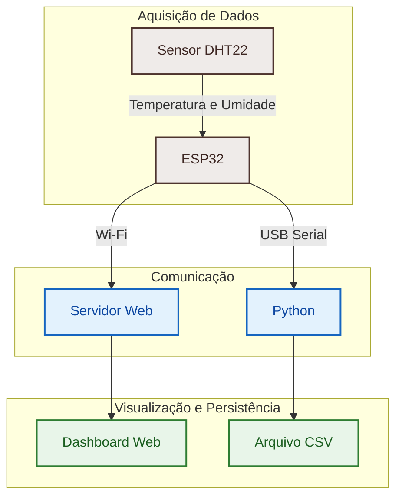

<div align="center">


# 🌡️ Projeto CoreTech - Sensor de Umidade e Temperatura

**Sistema IoT para monitoramento e registro em tempo real de dados climáticos utilizando ESP32 e sensor DHT22.**

<p>
  
  
  
  
  
  
</p>

</div>

---

> [!NOTE]
> Este projeto é uma iniciativa de automação de hardware vinculada à liga acadêmica **CORETECH**.
>
> O sistema realiza a aquisição contínua de temperatura e umidade utilizando um sensor **DHT22** conectado a um **ESP32**, disponibilizando os dados em tempo real através de um dashboard web embarcado e registrando as medições automaticamente em arquivos CSV por meio de um script em Python. Além disso, o projeto oferece suporte à simulação completa utilizando a plataforma **Wokwi**, facilitando estudos, testes e validações sem necessidade do hardware físico.

---

# 📑 Sumário

- [✨ Funcionalidades](#-funcionalidades)
- [🏗️ Arquitetura do Sistema](#️-arquitetura-do-sistema-visão-geral)
- [🛠 Tecnologias Utilizadas](#-tecnologias-utilizadas)
- [📁 Estrutura do Projeto](#-estrutura-do-projeto)
- [📄 Licença](#-licença)
- [👨‍💻 Autor](#-autor)

---

# ✨ Funcionalidades

O sistema embarcado oferece os seguintes recursos:

- 📡 Leitura contínua de temperatura e umidade utilizando o sensor DHT22.
- 🌐 Servidor Web embarcado executado diretamente no ESP32.
- 📊 Dashboard em tempo real acessível via navegador.
- 📈 Gráficos dinâmicos utilizando Highcharts.
- 💾 Registro automático das medições em arquivos CSV.
- 🐍 Script Python para coleta de dados via comunicação serial.
- 🔄 Atualização contínua dos dados ambientais.
- 🔌 Simulação completa utilizando a plataforma Wokwi.
- ⚙️ Firmware desenvolvido utilizando PlatformIO.

---

# 🏗️ Arquitetura do Sistema (Visão Geral)

O projeto segue uma arquitetura híbrida de **Internet das Coisas (IoT)**, separando a aquisição de dados, a comunicação e a persistência das informações.



---

# 🛠 Tecnologias Utilizadas

## Hardware e Firmware

| Categoria | Tecnologia |
|-----------|------------|
| Microcontrolador | ESP32 DOIT DEVKIT V1 |
| Framework | Arduino Core para ESP32 |
| Build Tool | PlatformIO |
| Sensor | DHT22 |
| Servidor Web | ESPAsyncWebServer |
| Comunicação Assíncrona | AsyncTCP |

---

## Dashboard

| Categoria | Tecnologia |
|-----------|------------|
| Linguagens | HTML, CSS e JavaScript |
| Interface | Página embarcada (`web.h`) |
| Biblioteca de Gráficos | Highcharts.js |

---

## Data Logging

| Categoria | Tecnologia |
|-----------|------------|
| Linguagem | Python 3 |
| Comunicação Serial | PySerial |
| Exportação | CSV |

---

## Simulação

| Categoria | Tecnologia |
|-----------|------------|
| Simulador | Wokwi |
| Configuração | diagram.json |

---

# 📁 Estrutura do Projeto

```text
Projeto-CoreTech---sensor-de-umidade-e-temperatura/
└── dht22/
    ├── include/
    │   └── web.h
    │
    ├── src/
    │   ├── main.cpp
    │   └── Serial.py
    │
    ├── diagram.json
    ├── platformio.ini
    ├── wokwi.toml
    └── README.md
```

---

# 📄 Licença

Este projeto está licenciado sob a licença **MIT**.

Consulte o arquivo **LICENSE** para mais informações.

---

# 👨‍💻 Autor

**Silas Santos**

Projeto desenvolvido para estudos e aplicações em **Internet das Coisas (IoT)**, sistemas embarcados, no contexto das atividades da liga acadêmica **CORETECH**.

---
